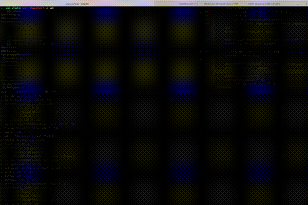

# Gaal



Gall is a Cosmwasm contract state watcher.

It now support these blockchains :
* KiChain
* KiChain Testnet
* Osmosis
* Juno
* Stargaze
* Chihuahua

## How to build
```bash
shell $ git clone https://github.com/SylvestreG/gaal
Cloning into 'gaal'...
remote: Enumerating objects: 44, done.
remote: Counting objects: 100% (44/44), done.
remote: Compressing objects: 100% (27/27), done.
remote: Total 44 (delta 12), reused 44 (delta 12), pack-reused 0
Receiving objects: 100% (44/44), 21.37 KiB | 370.00 KiB/s, done.
Resolving deltas: 100% (12/12), done.
shell $ cd gaal
shell $ cargo install --path .
  Installing gaal v0.1.1 (/tmp/gaal)
    Updating crates.io index
      Compiling gaal v0.1.0 (/tmp/gaal)
    Finished release [optimized] target(s) in 1m 08s
  Installing /tmp/gaal
   Installed package `gaal v0.0.1 (/tmp/gaal)` (executable `gaal`)
```

## How to launch

Simply give the contract address you want to watch to Gaal :

```bash
bash $ gaal stars1m8hp3rw4tkhp4ns3xw2w2rcpuml7thqlmzdnnz4qrkejxxa2amnq99g
```


### Override LCD
By default Gaal will find automatically a rest cosmos endpoint for you.
But if you want you can override the lcd provider like this

```bash
shell $ OVERLOAD_LCD='https://api-mainnet.blockchain.ki' gaal ki1ltd0maxmte3xf4zshta9j5djrq9cl692ctsp9u5q0p9wss0f5lmsc8qwrc
```

### Show logs
For debugging you can dump log to the standard output like this :

```bash
shell $ RUST_LOG=debug gaal ki1ltd0maxmte3xf4zshta9j5djrq9cl692ctsp9u5q0p9wss0f5lmsc8qwrc
```